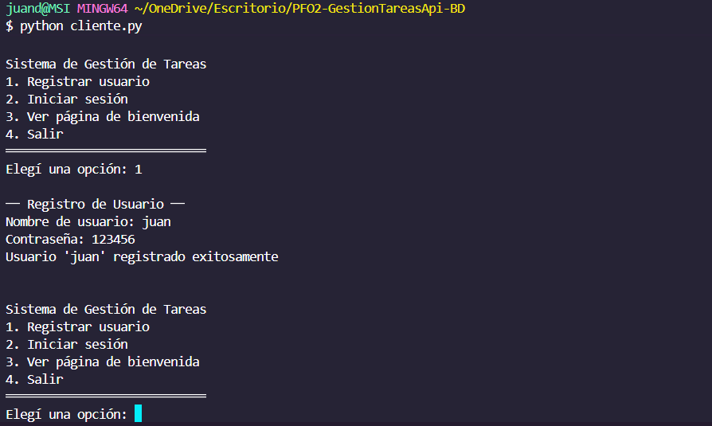
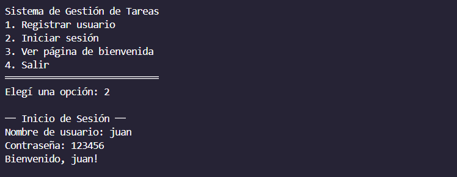
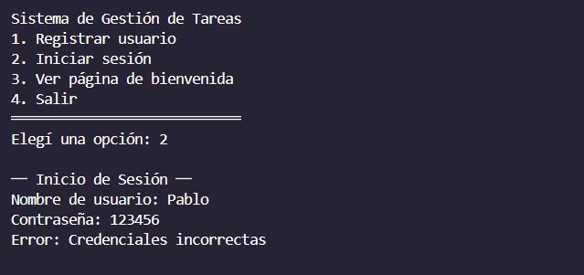
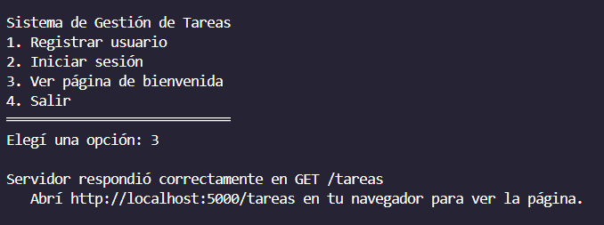
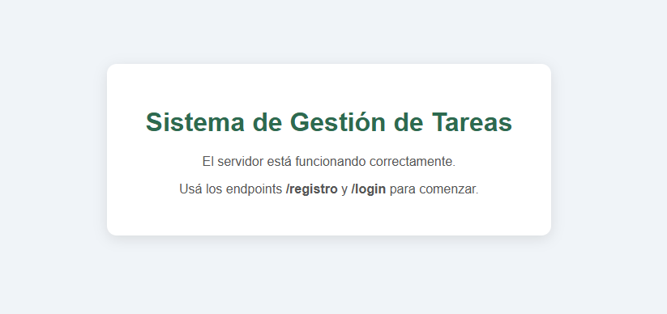

# PFO 2: Sistema de Gestión de Tareas con API REST y SQLite
 
Este proyecto implementa un sistema básico de autenticación y gestión de tareas utilizando una arquitectura Cliente-Servidor. Se utiliza Flask para el servidor API, SQLite para la persistencia de datos y una consola de comandos para el cliente.
 
---
 
## Requisitos
 
- Python 3.8+
- Librerías: `flask`, `requests`, `werkzeug`
---
 
## Instalación
 
1. Clonar o descargar el repositorio.
2. Instalar las dependencias:
```bash
pip install flask requests werkzeug
```
 
---
 
## Estructura del proyecto
 
```
PFO2/
├── servidor.py   # API REST con Flask y SQLite
├── cliente.py    # Cliente de consola
├── tareas.db     # Base de datos (se crea automáticamente)
└── README.md
```
 
---
 
## Ejecución
 
### 1. Iniciar el servidor
 
```bash
python servidor.py
```
 
El servidor quedará corriendo en `http://localhost:5000`.
 
### 2. Iniciar el cliente
 
Abrir una **nueva terminal** y ejecutar:
 
```bash
python cliente.py
```
 
---
 
## Endpoints disponibles
 
| Método | Endpoint    | Descripción                           |
|--------|-------------|---------------------------------------|
| POST   | `/registro` | Registra un nuevo usuario             |
| POST   | `/login`    | Verifica credenciales                 |
| GET    | `/tareas`   | Muestra una página HTML de bienvenida |
 
### Ejemplo de uso con el cliente
 
Al ejecutar `cliente.py` se presenta un menú interactivo:
 
```
╔══════════════════════════════╗
║   Sistema de Gestión de Tareas  ║
╠══════════════════════════════╣
║  1. Registrar usuario           ║
║  2. Iniciar sesión              ║
║  3. Ver página de bienvenida    ║
║  4. Salir                       ║
╚══════════════════════════════╝
```
 
---
 
## Capturas de pantalla
 
### Registro exitoso

 
### Login exitoso

 
### Login fallido

 
### Página de bienvenida


 
---